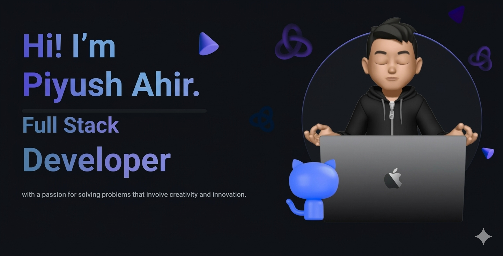

 
 <!--Header-->

 

 <!--

 

<!--Intro-->

 
## 𝐇𝐞𝐥𝐥𝐨 𝐭𝐡𝐞𝐫𝐞, 𝐟𝐞𝐥𝐥𝐨𝐰 <𝚌𝚘𝚍𝚎𝚛 />! 

> [!CAUTION]
> - 🔖 Congratulations you found me

> [!NOTE]
> - 🚙 I’m currently working on web development technologies like  `React` etc.

> [!IMPORTANT]
> - 📚 I’m currently learning **React frameworks** 😅

> [!WARNING]  
> - 💪🏼 Future Goals: Learn more technologie - Never stop creating new ideas.

> [!TIP]  
> - 📗 If you're interested in collaborating or have any questions — I'd love to hear from you!
