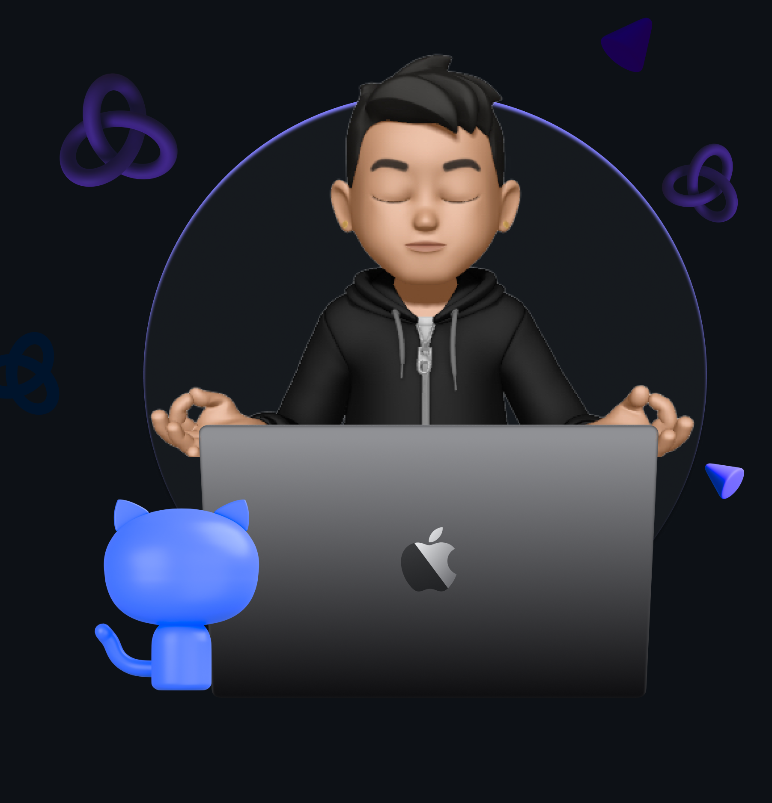

 

 

## 𝐇𝐞𝐥𝐥𝐨 𝐭𝐡𝐞𝐫𝐞, 𝐟𝐞𝐥𝐥𝐨𝐰 <𝚌𝚘𝚍𝚎𝚛 />! 

> [!CAUTION]
> - 🔖 Congratulations you found me

> [!NOTE]
> - 🚙 Currently building full-stack projects with `React` + `Node.js` + `MySQL`

> [!IMPORTANT]
> - 📚 Currently diving deep into **DSA in C++** & **React ecosystems**

> [!WARNING]  
> - 💪🏼 Future Goals: Crack a solid tech internship & master system design

> [!TIP]  
> - 📗 Open to collaborating on interesting projects — let's build something cool!

<h2 align="center">🧠 Core Programming</h2>
<table align="center">
  <tr>
    <td align="center"> <b>C</b></td>
    <td align="center"> <b>C++</b></td>
    <td align="center"> <b>Java</b></td>
    <td align="center"> <b>Python</b></td>
  </tr>
</table>

<h2 align="center">🌐 Web & Full-Stack Development</h2>
<table align="center">
  <tr>
    <td align="center"> HTML</td>
    <td align="center"> CSS</td>
    <td align="center"> JavaScript</td>
    <td align="center"> React</td>
    <td align="center"> Node.js</td>
    <td align="center"> Express</td>
    <td align="center"> Tailwind</td>
  </tr>
</table>

<h2 align="center">🧩 Databases</h2>
<table align="center">
  <tr>
    <td align="center"> MySQL</td>
    <td align="center"> MongoDB</td>
    <td align="center"> SQLite</td>
  </tr>
</table>

<h2 align="center">🤖 Machine Learning & Data Science</h2>
<table align="center">
  <tr>
    <td align="center"> Matplotlib</td>
    <td align="center"> NumPy</td>
    <td align="center"> Pandas</td>
    <td align="center"> Scikit-learn</td>
  </tr>
</table>

<h2 align="center">🛠️ DevOps, Systems & Tooling</h2>
<table align="center">
  <tr>
    <td align="center"> VS Code</td>
    <td align="center"> Git</td>
    <td align="center"> GitHub</td>
  </tr>
</table>

<h2 align="center">📊 GitHub Stats</h2>

  
  

<h2 align="center">🤝 Connect with Me</h2>

  
  &nbsp;&nbsp;&nbsp;
  
  &nbsp;&nbsp;&nbsp;
  

